# Agent Memory

This file is the machine-readable record of major changes to Kasie's architecture, design, and integrations. Agents and humans both write to it. It mirrors Kasie's own `kasie_memories` table: each entry is a triple in the form `entity -> relation -> target`, followed by a date `(YYYY-MM)` and a one-line rationale. When you make a major change (see `AGENTS.md` for what counts as major), append an entry to the matching section and update the graph below so both stay in sync. The human-readable companion is the decision log in the internal roadmap.

## Current-state graph

```mermaid
graph TD
  App["app"] -->|composed-of| Web["web (Next.js 16)"]
  App -->|composed-of| Worker["optional worker"]
  Queue["queue"] -->|backed-by| Postgres["postgres (kasie_queue_jobs)"]
  AIRuntime["ai-runtime"] -->|talks-to| Gateway["openai-compatible gateway"]
  Memory["memory"] -->|stored-as| PgvectorTriples["pgvector triples (kasie_memories)"]
  Credentials["credentials"] -->|encryptable-with| AES["aes-256-gcm vault (not yet wired)"]
  Auth["auth"] -->|handled-by| AuthJS["authjs v5"]
  Proactive["proactive"] -->|driven-by| Schedules["schedules (kasie_schedules)"]
  Proactive -->|driven-by| Heartbeat["cron heartbeat (/api/cron/heartbeat)"]
  Integrations["integrations"] -->|delegated-to| Pipedream["pipedream connect (OAuth vault + MCP)"]
  Channels["channels"] -->|live-on| Slack["slack"]
  Skills["skills"] -->|implemented-as| PromptPresets["prompt presets"]
  Dashboard["dashboard"] -->|built-on| DesignSystem["design-system primitives"]
  DesignSystem -->|styled-with| Tailwind["tailwind 4"]
  DesignSystem -->|typeset-in| Geist["geist"]
  DesignSystem -->|icons-from| Phosphor["phosphor icons"]
```

## Architecture

- `app -> composed-of -> web + optional worker` (2026-08) Single codebase serves Vercel (web only) and Docker/ECS (web + worker); no split services.
- `queue -> backed-by -> postgres` (2026-08) Jobs live in `kasie_queue_jobs`; no Redis or external broker to operate.
- `ai-runtime -> talks-to -> openai-compatible-gateway` (2026-08) One compat layer (`src/lib/ai/compat/`) against a single gateway endpoint; no direct provider SDKs.
- `memory -> stored-as -> pgvector-triples` (2026-08) Entity/relation/target rows in `kasie_memories` with 1536-dim embeddings, scoped per project.
- `credentials -> encryptable-with -> aes-256-gcm` (2026-08) `src/lib/db/vault.ts` implements an AES-256-GCM vault keyed by `ENCRYPTION_KEY`, but nothing calls it yet: the Slack bot token is stored raw in `kasie_integrations.encrypted_credentials_ref` until the vault is wired into writes. Secrets still never reach the client.
- `auth -> handled-by -> authjs-v5` (2026-08) Slack OIDC bootstraps the first install; later sign-in is invite-only via Slack/Google/GitHub.
- `proactive -> driven-by -> schedules-plus-cron-heartbeat` (2026-08) `kasie_schedules` plus `/api/cron/heartbeat`; the worker ticks internally, Vercel uses external cron, concurrent triggers are safe.

## Design

- `dashboard -> built-on -> design-system-primitives` (2026-08) Shared primitives and composites in `src/design-system/` instead of a component library dependency.
- `design-system -> styled-with -> tailwind-4` (2026-08) Tailwind 4 via PostCSS; tokens live in `src/design-system/index.css`.
- `design-system -> typeset-in -> geist` (2026-08) Geist as the single typeface for the dashboard.
- `design-system -> icons-from -> phosphor-icons` (2026-08) `@phosphor-icons/react` with `Icon`-suffixed imports; SSR variants for server components.
- `dashboard -> structured-as -> route-as-feature-module` (2026-08) Each dashboard route owns its components, actions, and queries under `src/app/dashboard/`.

## Integrations

- `integrations -> delegated-to -> pipedream-connect` (2026-08) OAuth vault plus MCP catalog covers 2,000+ apps without maintaining first-party connectors.
- `channels -> live-on -> slack-first` (2026-08) One complete channel beats four partial ones; Teams, Google Chat, and Discord are deferred with env placeholders reserved.
- `skills -> implemented-as -> prompt-presets` (2026-08) Skills in `src/lib/skills/catalog.ts` are toggleable prompt presets, not executable plugins.
