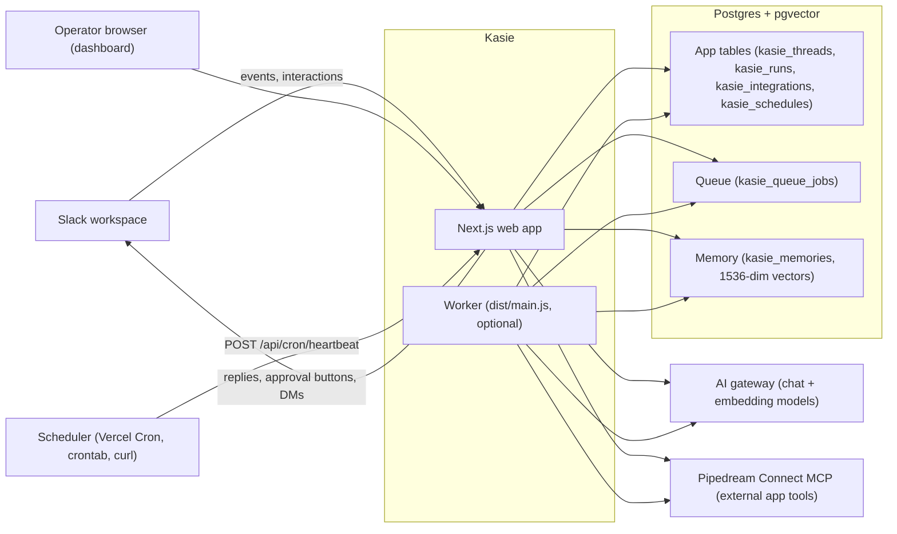

# Architecture

This page is for operators and developers who want to understand how Kasie runs before deploying or debugging it. It covers the two processes, the Postgres-backed queue, how a message becomes an agent run, and how tenants are isolated.

## The short version

Kasie is two processes and one database:

1. **The web app**: a Next.js server that serves the dashboard, receives Slack events, and exposes a small HTTP API.
2. **The worker** (optional): a small Node process, bundled from `src/worker/main.ts` into `dist/main.js`, that polls the job queue and runs scheduled tasks.
3. **Postgres**: one database holds everything, including the job queue and the memory store. There is no Redis and no separate vector database. The schema requires the pgvector extension (a Postgres extension that stores embedding vectors and can search them by similarity).

The worker is optional because the web app can process runs inline. On Vercel there is no long-lived worker at all; a cron job (a scheduled HTTP request) hits `POST /api/cron/heartbeat` every few minutes to fire scheduled work. See [Deploy on Vercel](9-deploy-vercel.md), [Deploy with Docker](10-deploy-docker.md), and [Deploy on ECS](11-deploy-ecs.md) for the three supported shapes.

## System diagram

## The two processes

### Web app

The Next.js app (`src/app/`) serves three audiences:

- **Slack** posts events to `/api/slack/events` and button clicks to `/api/slack/interactions`.
- **People** use the dashboard at `/dashboard` and the first-run wizard at `/onboarding` (see [Onboarding](6-onboarding.md)).
- **Machines** call the run API and the cron heartbeat (see [API Reference](13-api-reference.md)).

When a Slack message arrives, the web app creates a run and processes it inside the request using Next.js `after()` (work that continues after the HTTP response is sent). This is why Kasie works on Vercel with no worker: inbound messages never wait for a separate process.

### Worker

The worker is built by `npm run worker:build` (`scripts/worker.mjs` bundles `src/worker/main.ts` with esbuild) and started with `node dist/main.js` or `npm run worker`. Its loop, in `src/worker/main.ts`, does two things:

- Polls the queue every 2 seconds and processes any pending job.
- Runs the proactive tick every `PROACTIVE_TICK_MS` (default 60000 ms). The tick fires due rows in `kasie_schedules` and the initiative loop, so a deployment with a worker needs no external cron.

Docker Compose and ECS run web plus worker. Local dev (`npm run dev`) builds and starts the worker automatically, or drives the heartbeat over HTTP instead when `WEB_ONLY=1` is set.

## The queue: Postgres, not Redis

The queue provider is selected by `QUEUE_PROVIDER` in `src/lib/queue/index.ts`:

| Provider | Status | What it does |
|---|---|---|
| `postgres` (default) | Working | Jobs are rows in the `kasie_queue_jobs` table with statuses `pending`, `processing`, `completed`. Dequeue marks the row `processing` and sets `locked_at`; failures set it back to `pending` for retry. |
| `memory` | Working | An in-process array. Jobs disappear on restart. Useful for tests only. |
| `sqs` | **Not implemented** | The env schema accepts `QUEUE_PROVIDER=sqs` and a `QUEUE_URL`, and the ECS task definition sets them, but there is no SQS code. `getQueue()` silently falls back to the Postgres queue. Set `postgres` explicitly until an SQS provider ships. |

## Life of a run

1. A trigger arrives: a Slack message, an API call to `POST /api/agent/v1/runs`, a due schedule, or the initiative loop.
2. The web app upserts a row in `kasie_threads` (keyed by `project_id` plus an external thread key such as `channel:thread_ts` for Slack) and inserts a row in `kasie_runs` with status `queued`. Slack messages get an idempotency key (`slack:{ts}`) so retried deliveries never create duplicate runs.
3. A job is enqueued in `kasie_queue_jobs`. Inbound web triggers process it inline; the worker picks up anything left behind.
4. The orchestrator (`src/lib/agents/orchestrator.ts`) marks the run `running`, retrieves relevant memory (see [Memory](15-memory.md)), discovers tools from connected integrations (see [Integrations](12-integrations.md)), and calls the model through the AI gateway.
5. If the model tries **write** tools (anything that changes data in an external app), each call is intercepted, a row per call is created in `kasie_pending_actions`, and the run moves to `awaiting_approval`. This is HITL: human-in-the-loop, meaning a person approves before the agent acts. Each action gets its own approve/reject buttons in Slack; deciding one (`/api/slack/interactions`) executes or discards that tool and resumes the run with full thread context.
6. Otherwise the run completes: the transcript is appended to `kasie_interactions`, a conversation snippet is auto-stored in memory, token usage is written to `kasie_usage_ledger`, and the status becomes `completed` (or `failed`).

Run statuses: `queued`, `running`, `awaiting_approval`, `completed`, `failed`, `cancelled`.

## Multi-tenant isolation

One Kasie install can serve many teams. Each team is a **project** (`kasie_projects`), owned by an org (`kasie_orgs`), and bound to exactly one Slack workspace through the unique `platform_team_id` column. Every operational table (`kasie_threads`, `kasie_runs`, `kasie_memories`, `kasie_integrations`, `kasie_queue_jobs`, `kasie_schedules`, `kasie_project_config`) carries a `project_id`, and every query in `src/lib/db/queries/` filters by it. Memories, integrations, and configuration never leak between projects.

Per-project settings live in `kasie_project_config`: agent tone, workspace instructions, model tier (`ultra`, `smart`, `balanced`), enabled skill presets (see [Skills](14-skills.md)), and whether proactive behavior is on.

## AI gateway

Kasie talks to models through one OpenAI-compatible endpoint configured with `AI_GATEWAY_URL` and `AI_GATEWAY_API_KEY` (see [Environment Variables](7-environment-variables.md)). The compat layer in `src/lib/ai/compat/` discovers the gateway's model catalog and resolves the three tiers to concrete models; you can pin them with `MODEL_TIER_ULTRA`, `MODEL_TIER_SMART`, and `MODEL_TIER_BALANCED`. Without gateway credentials, Kasie still runs but every reply is a `[stub]` echo and embeddings are deterministic placeholder vectors, which is useful for trying the dashboard before wiring up a provider.

## Database client note

The runtime database client is the Neon serverless HTTP driver (`drizzle-orm/neon-http` in `src/lib/db/client.ts`). Neon is the recommended and tested Postgres. Migration tooling (`scripts/db.mjs`) uses the standard `postgres` driver, so it works against any Postgres. See the caveat in [Deploy with Docker](10-deploy-docker.md) if you plan to run against a self-hosted Postgres container.
